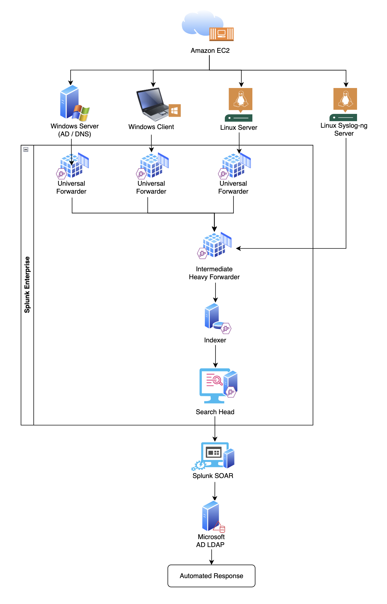
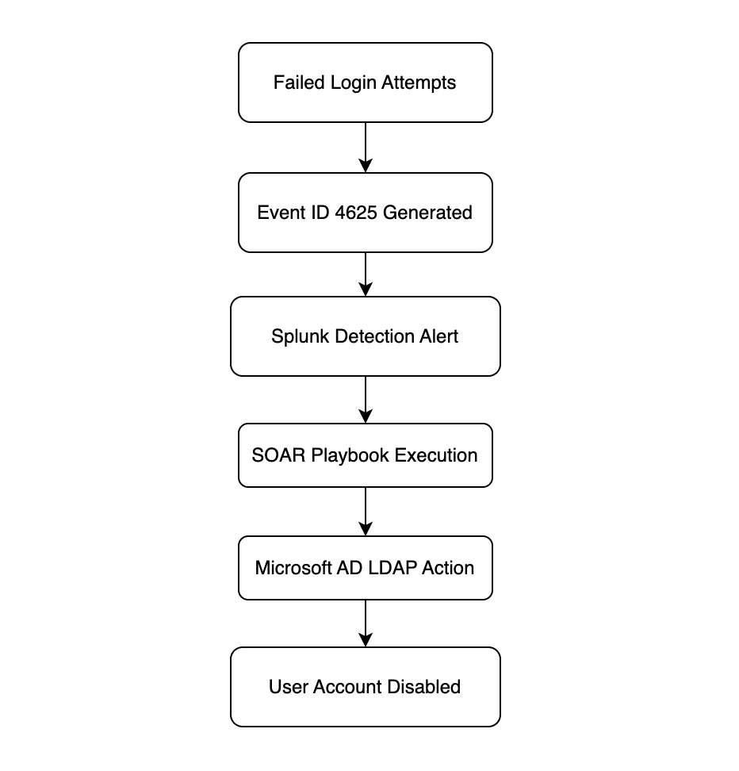
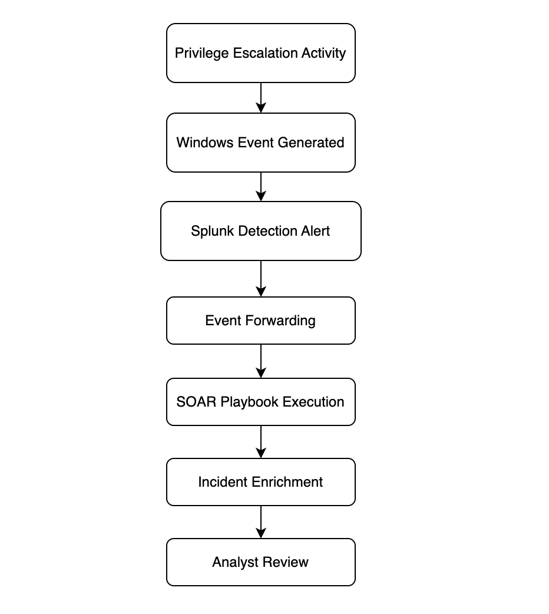

# End-to-End SIEM Deployment and Threat Detection Pipeline – NovaSec Solutions

## Project Overview

This project demonstrates the design, deployment, integration, and implementation of an end-to-end Security Information and Event Management (SIEM) and Security Orchestration, Automation and Response (SOAR) solution using Splunk Enterprise and Splunk SOAR.

The project was developed based on a client scenario in which an organization with over 1,000 Windows servers required centralized log collection, threat detection, incident enrichment, and automated response capabilities.

As an initial proof-of-concept, the solution demonstrates two security use cases:

1. Brute Force Attack Detection and Automated Response
2. Privilege Escalation Detection and Incident Enrichment

The project covers infrastructure deployment, log onboarding, SIEM configuration, SOAR integration, alert engineering, event forwarding, playbook development, attack simulation, validation, and response automation.

---

## Business Scenario

A client requested an Automated Threat Detection and Response solution using Splunk.

The environment contains multiple Windows-based services including:

- Active Directory
- DNS
- DHCP
- Microsoft SQL Server
- IIS Web Servers

The objective was to build a scalable SIEM and SOAR platform capable of:

- Centralized log collection
- Security monitoring
- Threat detection
- Incident response automation
- Security event enrichment

---

## Overall Architecture

The following diagram illustrates the end-to-end architecture implemented in this project, including data sources, log collection, Splunk Enterprise components, Splunk SOAR integration, and automated response capabilities.



---

## Solution Architecture

### Infrastructure Components

| Component                         | Quantity |
| --------------------------------- | -------- |
| Splunk Search Head                | 1        |
| Splunk Indexer                    | 1        |
| Splunk Heavy Forwarder            | 1        |
| Splunk SOAR                       | 1        |
| Windows Server 2022 (AD DS / DNS) | 1        |
| Windows Client                    | 1        |
| Linux Data Source Servers         | 2        |
| Syslog-ng Server                  | 1        |

### Platform

- AWS EC2
- Red Hat Enterprise Linux 9.6
- Windows Server 2022
- Windows 11 Client

---

## Technologies Used

### SIEM

- Splunk Enterprise 9.4.9
- Splunk Universal Forwarder
- Splunk Heavy Forwarder

### SOAR

- Splunk SOAR 7.1.0.225
- Splunk App for SOAR Export
- Microsoft AD LDAP App

### Operating Systems

- Red Hat Enterprise Linux 9.6
- Windows Server 2022
- Windows 11

### Security Technologies

- Active Directory
- DNS
- Syslog-ng
- Windows Event Logging

### Cloud Platform

- Amazon Web Services (AWS)

---

## Security Use Cases Implemented

### Use Case 1 – Brute Force Detection and Automated Response

#### Objective

Detect repeated failed login attempts using Windows Event ID 4625 and automatically disable the targeted account through Splunk SOAR.

#### Workflow



#### Documentation

- Architecture and Workflow
- Alert Creation
- SOAR Playbook Development
- Attack Simulation
- Results and Analysis

---

### Use Case 2 – Privilege Escalation Detection and Incident Enrichment

#### Objective

Detect users added to privileged groups such as Domain Admins and Local Administrators using Windows Event IDs 4728 and 4732.

#### Workflow



#### Documentation

- Architecture and Workflow
- Prerequisites and Configuration
- Attack Simulation
- Log Validation
- Alert Engineering
- Event Forwarding
- SOAR Playbook Development
- Results and Analysis

---

## Repository Structure

```text
images
|
├── overall_architecture.png
├── BruteForce_architecture_diagram.png
├── BruteForce_workflow_diagram.png
├── BruteForce_workflow_readme.png
├── PrivEsc_architecture_diagram.png
├── PrivEsc_workflow_diagram.png
├── PrivEsc_workflow_readme.png

01_Infrastructure_Setup
│
├── 01_Creation_of_EC2_Instances_V1.pdf
├── 02_Install_and_Configure_syslog-ng_Linux_V1.pdf
├── 03a_Install_and_Configure_AD_DNS_WinServer_Client_V2.pdf
└── 03b_Install_and_Configure_AD_DNS_WinServer_Client_V3.pdf

02_Splunk_Deployment
│
├── 04_Install_Splunk_on_Splunk_Component_Instances_V1.pdf
├── 05_Connect_SearchHead_with_Indexer_V1.pdf
└── 06_Connect_HeavyForwarder_with_Indexer_V1.pdf

03_Data_Onboarding
│
├── 07_Onboarding_Data_From_Linux_Server_V1.pdf
├── 07a_Install_Splunk_UF_Linux_Server_V1.pdf
├── 07b_Connect_UF_With_HF_V1.pdf
├── 08_Onboard_Data_From_Syslog_ng_Server_V1.pdf
└── 09_Onboard_Data_From_Windows_Server_V1.pdf

04_SOAR_Deployment_Integration
│
├── 10_Install_Splunk_SOAR_on_EC2_Instance_V1.pdf
├── 11_Connect_SIEM_With_SOAR_V1.pdf
├── 12_Install_Required_Apps_Indexer_and_SearchHead_V1.pdf
├── 13_Splunk_SOAR_Integration_SearchHead_V1.pdf
├── 14_Integrate_SOAR_With_Microsoft_AD_Server_Part1_V1.pdf
└── 15_Integrate_SOAR_With_Microsoft_AD_Server_Part2_V1.pdf

05_BruteForce_UseCase
│
├── 16_BruteForce_UseCase_Architecture_and_Workflow_V1.pdf
├── 17_Creating_BruteForce_Alerts_From_Splunk_V1.pdf
├── 18_Creating_BruteForce_Playbook_SOAR_V1.pdf
├── 19_Implementing_BruteForce_Attack_WinClient_User_V1.pdf
└── 20_Test_Results_Observations_and_UseCase_Summary_BruteForce_V1.pdf

06_Privilege_Escalation_UseCase
│
├── 21_PrivilegeEscalation_UseCase_Architecture_and_Workflow_V1.pdf
├── 22_Prerequisites_Server_Client_before_Implementing_PrivEsc_UseCase_V1.pdf
├── 23_Implementing_PrivEsc_Attack_WinServer_WinClient_V1.pdf
├── 24_Logs_Validation_Using_Extraction_Detection_for_ServerClient_Events_V1.pdf
├── 25_Creating_Privilege_Escalation_Alert_Splunk_Enterprise_V1.pdf
├── 26_Creating_EventForwarding_Splunk_App_for_SOAR_Export_App_V1.pdf
├── 27_Creating_Privilege_Escalation_SOAR_Playbook_V1.pdf
└── 28_Test_Results_Observations_and_UseCase_Summary_PrivEsc_V1.pdf
```

---

## Key Outcomes

- Successfully deployed a multi-component Splunk Enterprise environment.
- Implemented centralized log collection from Windows and Linux systems.
- Integrated Splunk Enterprise with Splunk SOAR.
- Developed automated response workflows.
- Implemented Brute Force Detection and Automated Account Disablement.
- Implemented Privilege Escalation Detection and Incident Enrichment.
- Demonstrated end-to-end SOC monitoring and response capabilities.
- Validated detection logic through controlled attack simulations.
- Implemented event forwarding and security event enrichment workflows.

---

## Skills Demonstrated

- Splunk Enterprise Administration
- Splunk SOAR Automation
- SIEM Deployment
- Detection Engineering
- Security Monitoring
- Incident Response
- Active Directory Security
- Windows Event Analysis
- Event Forwarding
- Log Management
- AWS EC2 Administration
- Linux Administration
- Security Operations Center (SOC) Workflows

---

## Future Improvements

Future enhancements that can be implemented include:

- Additional attack simulations and detection use cases.
- Dynamic severity assignment based on risk scoring.
- Automated privilege revocation for unauthorized group membership changes.
- Integration with Threat Intelligence Platforms (TIPs).
- Microsoft Teams and Email notifications.
- MITRE ATT&CK framework mapping.
- Dashboard development for SOC monitoring.
- Detection of lateral movement techniques.
- Detection of suspicious PowerShell execution.
- Splunk clustering and high availability deployment.
- Integration with additional Windows and Linux data sources.

---

## Author

**Anusha Ramu Chakravarthi**

Junior Cyber Security Analyst | Splunk SIEM | Splunk SOAR | Threat Detection | Security Operations

### Technologies

Splunk Enterprise • Splunk SOAR • Active Directory • Windows Security Monitoring • AWS EC2 • Threat Detection • Incident Response
